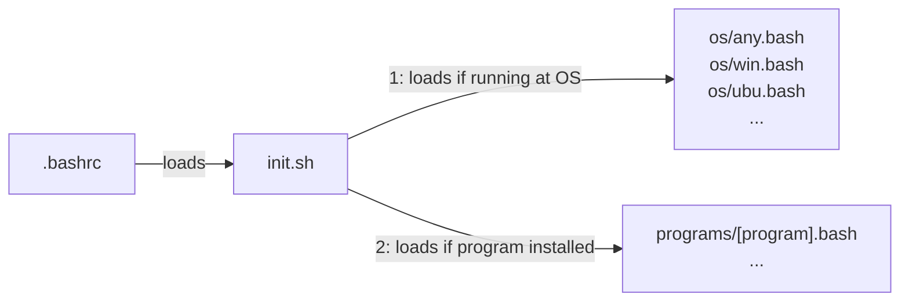
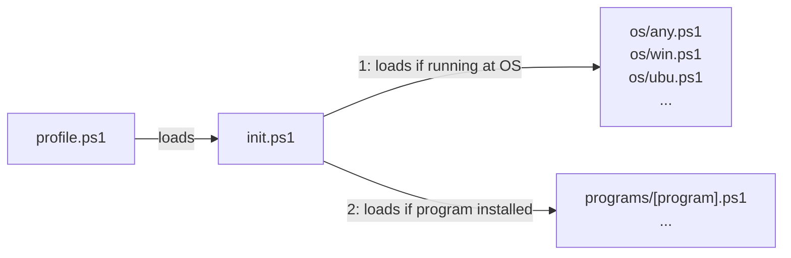

# cli-helpers

`cli-helpers` is a library for organizing your Bash and PowerShell helper scripts. It automatically loads scripts from the `os/` directory based on your current operating system, and from the `programs/` directory if a specific program is installed. To use the library, you need to load [`init.sh`](init.sh) in your `.bashrc` and [`init.ps1`](init.ps1) in your PowerShell `$PROFILE`. The diagrams below provide an overview of the library's behavior.

**from bash:**



**from powershell:**



## Bash Setup

You can use the Bash commands below to fetch, install, and setup `cli-helpers` to be loaded in your `.bashrc`:

```bash
git clone https://github.com/alanlivio/cli-helpers ~/cli-helpers
. ~/cli-helpers/setup_profile_loading.sh
```

## PowerShell Setup

You can use the PowerShell commands below to fetch, install, and setup `cli-helpers` to be loaded in your `profile.ps1`:

```powershell
git clone https://github.com/alanlivio/cli-helpers $env:USERPROFILE\cli-helpers
& $env:USERPROFILE\cli-helpers\setup_profile_loading.ps1
```

## Adding Custom Scripts

To add a script that only loads when a specific program is installed (e.g., `docker`), simply create a file at `programs/docker.bash` or `programs/docker.ps1`. The library handles the rest and will automatically load it when the program is detected!

## References

This project takes inspiration from:

- <https://github.com/Bash-it/bash-it>
- <https://github.com/milianw/shell-helpers>
- <https://github.com/wd5gnr/bashrc>
- <https://github.com/martinburger/bash-common-helpers>
- <https://github.com/jonathantneal/git-bash-helpers>
- <https://github.com/donnemartin/dev-setup>
- <https://github.com/aspiers/shell-env>
- <https://github.com/nafigator/bash-helpers>
- <https://github.com/TiSiE/BASH.helpers>
- <https://github.com/midwire/bash.env>
- <https://github.com/e-picas/bash-library>
- <https://github.com/awesome-windows11/windows11>
- <https://github.com/99natmar99/Windows-11-Fixer>
- <https://github.com/W4RH4WK/Debloat-windows-10/tree/master/scripts>
